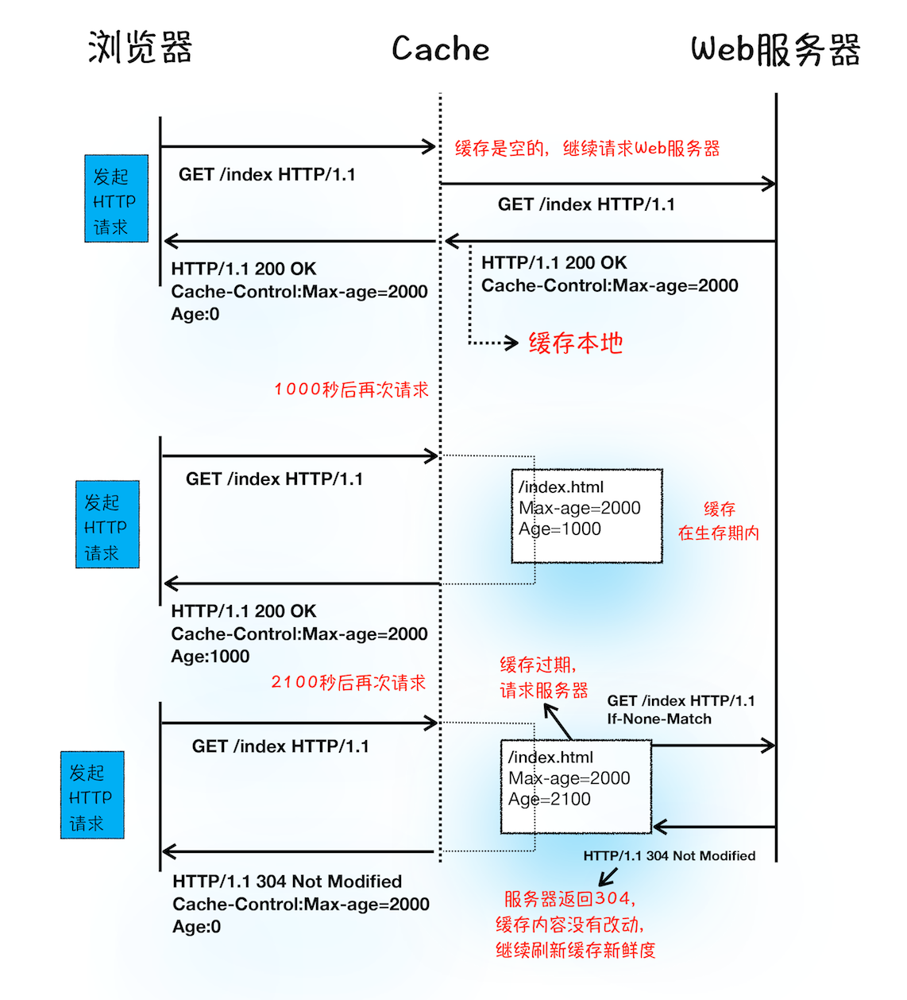

# 缓存

## Chrome 三级缓存
先查找内存，如果内存中存在，从内存中加载；
如果内存中未查找到，选择硬盘获取，如果硬盘中有，从硬盘中加载；
如果硬盘中未查找到，那就进行网络请求；
加载到的资源缓存到硬盘和内存；
- from disk：新tab打开时；缓存的html文件
- from memory：新tab再次使用缓存时，对应一个渲染进程的生命周期
### 强制刷新
全部走网络请求

## Service Worker
持久化的离线缓存
- https
- 单独的线程，worker上下文，不能访问DOM
- 完全异步，同步API不可用（比如XHR，localStorage）
## Etag 和 Last-Modified
HTTP1.1中Etag的出现主要是为了解决几个Last-Modified比较难解决的问题：
一些文件也许会周期性更改，但是它的内容并不改变（仅仅改变了修改时间），这个时候我们并不希望客户端认为这个文件被修改过了，而重新GET。
某些文件修改非常频繁，比如是在秒以下时间内进行修改多次（比如说1s的时间内修改了N次），if-Modified-Since能检查到的粒度是s级的，这种修改无法判断（或者说UNIX记录MTIME只能精确到秒）。
某些服务器不能精确的得到文件的最后修改时间。

这时，利用Etag能够更加准确的控制缓存，因为Etag是服务器自动生成或者由开发者生成的对应资源在服务器端的唯一标识符。