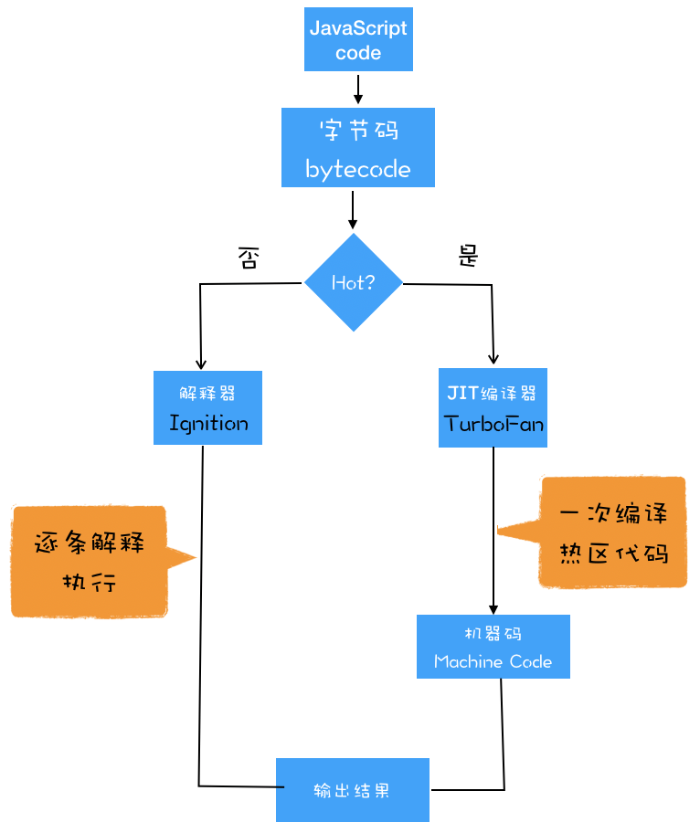

# V8


1. 生成抽象语法树（AST）和执行上下文
先分词（tokenize）再解析（parse），获得 [AST](http://resources.jointjs.com/demos/javascript-ast)，然后生成执行上下文

2. 生成字节码
解释器 Ignition 根据 AST 生成字节码，并解释执行字节码。
- 字节码： 介于 AST 和 机器码 之间的一种代码。但是与特定类型的机器码无关，字节码需要通过解释器将其转换为机器码后才能执行。
- 使用字节码可以减少系统的内存使用
3. 执行
通常，如果有一段第一次执行的字节码，*解释器 Ignition* 会逐条解释执行。在 Ignition 执行字节码的过程中，如果发现有热点代码（HotSpot），那么后台的*编译器 TurboFan* 就会把该段热点的字节码编译为高效的机器码，然后当再次执行这段被优化的代码时，只需要直接执行编译后的机器码就可以了，这样就大大提升了代码的执行效率。
- 热点代码：比如一段代码被重复执行多次

## 编译器（Compiler）
编译型语言在程序执行之前，需要经过编译器的编译过程，并且编译之后会直接保留机器能读懂的二进制文件，这样每次运行程序时，都可以直接运行该二进制文件，而不需要再次重新编译了。
## 解释器（Interpreter）
由解释型语言编写的程序，在每次运行时都需要通过解释器对程序进行动态解释和执行。Js 是解释型语言。


## 即时编译（JIT）
字节码配合解释器和编译器。  
在V8中，是指解释器 Ignition 在解释执行字节码的同时，收集代码信息，当它发现某一部分代码变热了之后，TurboFan 编译器把热点的字节码转换为机器码，并把转换后的机器码保存起来，以备下次使用。  
苹果的 SquirrelFish Extreme 和 Mozilla 的 SpiderMonkey 也都使用了该技术  
  

### 示例
```js
var a;
for (var i = 0; i < 10; i++) {
  if (i > 5) {
    // 此处 a 的类型 变更为 String 之前的优化假设失效，于是进行“去优化”
    a = 'a';
  } else {
    // i <= 5 的情况下，Ignition 根据 AST 生成字节码并解释执行
    // 对于频繁操作的 Number 类型数相加，TurboFan会将此处的热点字节码转换为机器码并存储
    a += i;
  }
}
```


## 需要注意的一些性能优化

1. 提升单次脚本的执行速度，避免 JavaScript 的长任务霸占主线程，这样可以使得页面快速响应交互；
2. 避免大的内联脚本，因为在解析 HTML 的过程中，解析和编译也会占用主线程；
3. 减少 JavaScript 文件的容量，因为更小的文件会提升下载速度，并且占用更低的内存。