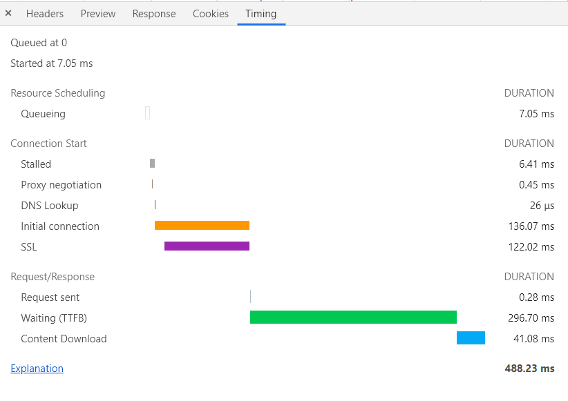

# 工作流程


## 模型
客户端请求，服务端响应

## 处理
1. 访问一个网址
    - 确认协议，构建请求
    - 浏览器进程通过 IPC 将请求发送给网络进程
    - 缓存查询，在浏览器缓存中查询是否有要请求的文件。若缓存命中，则直接返回，否则进行网络请求
    <!-- - 跨越网关（如：防火墙） -->
2. 域名解析
    - DNS（Domain Name System）服务器，迭代查询，将域名转换为目标ip
    - DNS 数据缓存服务：如果某个域名已经解析过了，那么浏览器会缓存解析的结果
    - 如果请求协议是 HTTPS 还需建立 TLS 连接
3. 等待/建立TCP
    - Chrome 中同一域名最多允许同时 6 个 tcp连接
4. [HTTP](../protocol/http.md)请求
    - 请求行、请求头、请求体

5. 服务器处理请求，并响应
6. 网络进程解析响应，根据响应头信息决定处理行为
    - 状态码
    - 响应文本类型
7. 进入[渲染](./render.md)阶段

```bash
# 保持 TCP 连接可以省去下次请求时需要建立连接的时间，提升资源加载速度
Connection:Keep-Alive
```
6. 浏览器处理HTML页⾯
    - 准备/复用渲染进程 采取 `process-per-site-instance` 策略
7. 继续请求其他资源

### 服务器重定向
需要重定向的网址包含在响应头的 Location 字段中，浏览器获取 Location 字段中的地址，并使用该地址重新导航，

### timing-overview
https://www.w3.org/TR/navigation-timing/#sec-navigation-timing


1. prompt for unload 提示卸载 event: beforeunload
    - navigationStart 导航开始，用户发出 URL 请求到页面开始解析
2. redirect 页面重定向
    - redirectStart 重定向开始
    - redirectEnd 重定向结束
3. unload 卸载，与重定向可同时发生
    - unloadStart 卸载开始； unloadEventStart 卸载开始之前的时间
    - unloadEnd 卸载结束； unloadEventEnd 卸载完成的时间
4. APP cache 应用缓存
    - fetchStart HTTP GET等效方式请求资源前的时间 （若有缓存，则记录为当前时间，否则记录为请求资源开始前的时间）

```网络开始```

5. DNS (应用层协议，使用的传输层协议是UDP，使用CDN优化)
    - domainLookupStart 查询DNS的开始时间。如果请求没有发起DNS请求，如keep-alive，缓存等，则返回fetchStart
    - domainLookupEnd 查询DNS的结束时间。如果没有发起DNS请求，同上

```TCP开始```

6. TCP (可使用长连接进行优化)
    - connectStart 开始建立TCP请求的时间。如果请求是keep-alive，缓存等，则返回domainLookupEnd
    - (secureConnectionStart) 如果在进行TLS或SSL，则返回握手时间
    - connectEnd 完成TCP链接的时间。如果是keep-alive，缓存等，同connectStart

```HTTP开始```

7. Request 请求
    - requestStart 发起请求的时间
8. Response 响应
    - responseStart 服务器开始响应的时间
    - responseEnd 服务器结束响应的时间

```网络结束```

9. Processing 处理(默认为HTML文档，描述Document.readyState: ``` loading、interactive、complete ```)
    - domLoading 正在加载之前立即记录
    - domInteractive 可交互之前立即记录， 页面呈现
    - domContentLoaded 
        - domContentLoadedEventStart DOMContentLoaded事件之前，立即记录
        - domContentLoadedEventEnd  domContentLoaded 事件结束
    - domComplete 就绪 complete： $(function(){}) => window.addEventListener('domContentLoaded')

10. onLoad 文档加载
    - loadEventStart 触发加载的时间
    - loadEventEnd 加载完成 开始由渲染器渲染 ``` window.onload  全部资源加载完毕```
[onload](./index.html)


## 资源请求及优化
Chrome - Network 中查看 Timing

### 排队（Queuing）
- 资源优先级：比如 CSS、HTML、JavaScript 等都是页面中的核心文件，优先加载；而图片、视频、音频这类资源就不是核心资源，优先级就比较低。
- 浏览器为每个域名最多维护 6 个 TCP 连接，当这 6 个 TCP 连接都处于忙碌状态时，那么新的请求就会处于排队状态。
- 网络进程在为数据分配磁盘空间时，新的 HTTP 请求也需要短暂地等待磁盘分配结束。

#### Queuing优化
1. 域名分片：将站点资源放到多个域名下，拓展 tcp 连接 
2. 升级到 HTTP2。 HTTP2不再对单域名有 6 个 TCP 的限制

### Stalled
停滞，连接过程被推迟
### Proxy Negotiation
代理协商，代理服务器连接协商所用的时间
### DNS Lookup
DNF查询
### Initial connection
初始化链接
### SSL
使用了https，ssl握手
### Request sent
请求发出
### Waiting（TTFB）
TTFB（接受到第一字节的时间） 反映服务端响应速度，TTFB 时间越短，说明服务器响应越快
#### TTFB 优化
1. 确保服务器处理速度
2. 使用 CDN 缓存
3. 减少请求头数据（尤其是Cookie中不必要的信息） / HTTP2 头部压缩
### Content Download
整个接收字节过程的时间

#### Content Download 优化
主要是减小单个资源的大小，比如压缩文件体积


