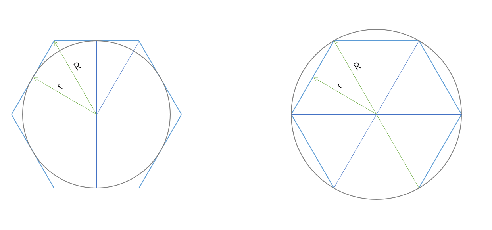

球面投影 
材料： 3200*1600 图片进行等分切割
如下图所示：通常使用右侧外接圆
设图片材料长L，切割分数为N， 顶角α=360/N ，每份底边长l = L/N
则有 l/r = tan(α/2) 从而求得图片应当被推离圆心的距离r (translateZ)

立方体投影: 
材料：1600*1600的正方形图片 一个立方体由6面组成

css3d引擎
https://github.com/shrekshrek/css3d-engine //造物节H5作者，有很多实用工具可以看看
视差特效引擎
https://github.com/wagerfield/parallax