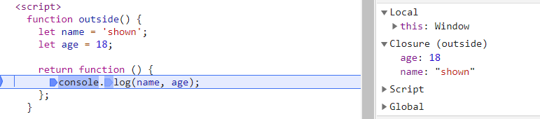

# 闭包
1. 闭包是函数和声明该函数的词法环境的组合。
2. 通常认为的闭包：在 JavaScript 中，根据词法作用域的规则，内部函数总是可以访问其外部函数中声明的变量，当通过调用一个外部函数返回一个内部函数后，即使该外部函数已经执行结束了，但是内部函数引用外部函数的变量依然保存在内存中，这些变量的集合称为闭包。比如外部函数是 foo，那么这些变量的集合就称为 foo 函数的闭包。
3. 浏览器中调试的呈现
根据第1点，只要内部函数对外部函数变量存在引用，就创建名为外部函数名的闭包对象。闭包内变量通过扫描当前词法下所有内部函数引用的外部变量得到。 

## 结合闭包的变量查找
当前执行上下文 –> outside 函数闭包 –> 全局执行上下文
```js
function outside() {
  let name = 'shown';
  let age = 18;
  return function() {
    console.log(name, age);
  };
}

let name = 'oso';
let age = 81;
var inner = outside();
inner();
```



```js
  [[Scopes]]: [
  Closure {}, // 闭包
  // ......  根据作用域链的概念，可能存在多级闭包
  Global {},
  ]
```

## 注意点
如果该闭包会一直使用，那么它可以作为全局变量而存在；如果使用频率不高，而且占用内存又比较大的话，那就尽量让它成为一个局部变量。

1. 时间
  - 闭包中的变量由于已被解析并驻于内存（直到函数销毁被 GC 回收），所以相同逻辑下能够提高执行效率。
  - 需要多一层或者几层变量查找，增加了变量查找范围和时间，一般情况下，变量查找耗时可几乎忽略不计。

2. 空间
  - 占用内存空间。
  - 空间换时间。

3. 回收：将使用了闭包的函数置空告知 GC 下一次任务时进行清除 fn = null
  - 如果引用闭包的函数是一个全局变量，那么闭包会一直存在直到页面关闭；但如果这个闭包以后不再使用的话，就会造成内存泄漏。
  - 如果引用闭包的函数是个局部变量，等函数销毁后，在下次 JavaScript 引擎执行垃圾回收时，判断闭包这块内容如果已经不再被使用了，那么 JavaScript 引擎的垃圾回收器就会回收这块内存。

