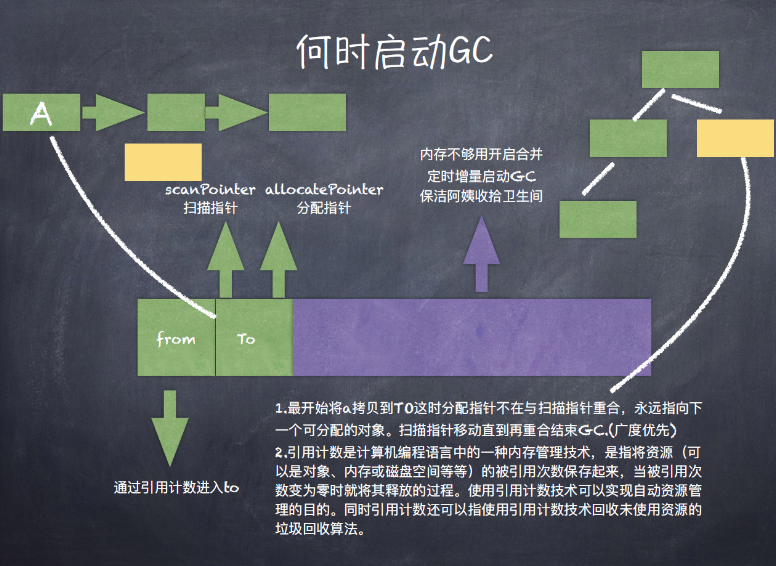
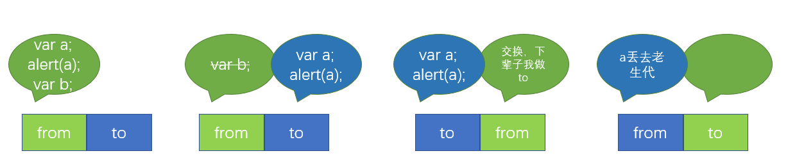

## V8的垃圾回收机制
分代式垃圾回收机制

### 内存管理

**内存限制**

Node使用JavaScript在服务端操作大内存对象受到了一定的限制(堆区)，64位系统下约为1.4GB，栈区32位操作系统下是0.7G
限制内存原因：垃圾回收时，js线程会暂停执行（避免JS应用逻辑与垃圾回收器看到的不一样），大量的堆内存回收严重影响性能

**内存使用情况**
```js
process.memoryUsage()
// { rss: 20828160, //所有内存使用包括堆区和栈区
//   heapTotal: 6537216, //堆区占用内存
//   heapUsed: 4011648, //已使用到的堆部分
//   external: 8680 } //V8引擎C++对象占用   (GC动态变化)
```

所有javascript(js)对象都放在V8管理的堆内存(heap)，heap分多个空间(space)，查看有多少个space可以运行以下的代码

```js
var v8 = require('v8')
console.log(v8.getHeapSpaceStatistics())
//  ！buffer对象是放在堆外的！
// [ { space_name: 'read_only_space',
//     space_size: 524288,
//     space_used_size: 35184,
//     space_available_size: 480400,
//     physical_space_size: 524288 },
//   { space_name: 'new_space',
//     space_size: 2097152,
//     space_used_size: 894960,
//     space_available_size: 136208,
//     physical_space_size: 2097152 },
//   { space_name: 'old_space',
//     space_size: 2854912,
//     space_used_size: 2510944,
//     space_available_size: 64208,
//     physical_space_size: 2854912 },
//   { space_name: 'code_space',
//     space_size: 1048576,
//     space_used_size: 590624,
//     space_available_size: 0,
//     physical_space_size: 1048576 },
//   { space_name: 'map_space',
//     space_size: 536576,
//     space_used_size: 343728,
//     space_available_size: 0,
//     physical_space_size: 536576 },
//   { space_name: 'large_object_space',
//     space_size: 0,
//     space_used_size: 0,
//     space_available_size: 1519656448,
//     physical_space_size: 0 } ]
```


与GC相关的space有 new_space和old_space

### 回收策略与算法
1. V8的垃圾回收策略主要基于**分代式垃圾回收机制**。在自动垃圾回收的演变过程中，人们发现没有一种垃圾回收算法能够胜任所有场景。V8中内存分为**新生代**和**老生代**两代。
```bash

# 限制V8里面的new_space的最大值 单位kb 默认64位32M 32位16M
node --max-new-space-size=1024 test.js 

# 限制V8里面的old_space的最大值 单位mb 记得增大它！记得！记得！性能飞起 默认64位1.4G 32位0.7G
node --max-old-space-size=1700 test.js

# 能限制new space里面的from或者to空间的最大值
--max-semi-space-size

# 不使用增量marking GC算法，old_space内存到达最大值的时候才进行一次full gc
--noincremental_marking

#  V8的gc日志 有用的嘞
--trace-gc

# 得到v8性能分析数据
--prof

```

####  new_space： 新生代内存空间
1. 对象被创建时的首选，如果放不下，就丢large_object_space
2. 存放存活时间较短的对象
3. [scavenge算法](#scavenge算法)

####  old_space： 老生代内存空间
1. 存放存活时间较长或常驻内存的对象
2. [Mark-Sweep & Mark-compact算法](#Mark-Sweep&Mark-compact算法)


### 何时启动GC



#### 引用计数 
```js
function Student(name) {
  this.name = name;
}
//demo1
let student1 = new Student();
let student2 = new Student();
setTimeout(function () {
  student1 = null;
},3000);
//demo2
let student1 = new Student("shown");
let stuSet = new Set();
stuSet.add(student1)
student1 = null;
stuSet = null;

//闭包在堆区
let StuFactory = function (name) {
  let student = new Student(name);
  return function () {
    console.log(student);
  }
}
let s1 = StuFactory("shownoso");
s1();
s1 = null;

```


### 高效使用内存

**内存泄漏**
* 缓存、队列销毁不及时
* 作用域未释放
* 无限制增长的数组、无限制设置属性和值
* 任何模块内的私有变量和方法均是永驻内存的 
* 大循环，无GC机会
......

**内存泄漏排查**  memwatch+heapdump
参考： https://www.cnblogs.com/ldlchina/p/4762036.html
0. node-inspector + chrome 调试


1. 使用node-heapdump查看：
```js
var heapdump = require('heapdump');
// code here
```
```bash
# 获取堆内存快照
kill -USR2 <pid>
```

2. 使用node-memwatch监测：
```js
var memwatch = require('memwatch');
memwatch.on('leak', function(info) {
  console.log('leak:');
  console.log(info);
});
memwatch.on('stats', function(stats) {
  console.log('stats:');
  console.log(stats);
});
```

3. 抓取并比较：
```js
var memwatch = require('memwatch');
var leakArray = [];
var leak = function() {
    leakArray.push("leak" + Math.random());
};
// Take first snapshot
var hd = new memwatch.HeapDiff();
for (var i = 0; i < 10000; i++) {
    leak();
}
// Take the second snapshot and compute the diff 
var diff = hd.end();
console.log(JSON.stringify(diff, null, 2));

```


**作用域**
主动释放全局变量 赋值为null undefined

**闭包**
把闭包赋值给一个不可控的对象时，会导致内存泄漏。使用完，将变量赋其他值或置空

**缓存**
为了加速模块引入，模块会在编译后缓存，由于通过exports导出(闭包),作用域不会释放，常驻老生代。要注意内存泄漏。
使用进程外缓存，比如node_redis、Memcached

**队列状态**
* 限制队列的长度
* 任意的异步调用应该包含超时机制

**大内存应用**
* 使用stream模块处理大文件
* 在不需要进行字符串操作时，可以不借助v8，使用Buffer操作，这样不会受到v8的内存限制.buffer对象是放在堆外的


## 附录

### scavenge算法


**描述**
在分代基础上，新生代的对象主要通过Scavenge算法进行垃圾回收，再具体实现时主要采用Cheney算法。空间换时间。
Cheney算法是一种采用复制的方式实现的垃圾回收算法。它将内存一分为二，每一个空间称为semispace。这两个semispace中一个处于使用，一个处于闲置。处于使用的称之为From,闲置的称之为To.分配对象时先分配到From,当开始进行垃圾回收时，检查From存活对象赋值到To.非存活被释放。然后互换位置。再次进行回收，发现**被回收过**或者发现**To空间已经使用了超过25%**直接提升**(promote)到old_space**。他的缺点是只能使用堆内存的一半，这是一个典型的空间换时间的办法，但是新生代声明周期较短，恰恰就适合这个算法。


### Mark-Sweep&Mark-compact算法


**描述**
V8老生代主要采用Mark-Sweep和Mark-compact。
Mark-Sweep是标记清除，通过遍历一组根元素，标记那些死亡的对象，然后清除。但是清除过后出现内存不连续的情况，所以要使用Mark-compact。Mark-compact是基于Mark-Sweep演变而来的，他先将活着的对象移到一边，移动完成后，直接清理边界外的内存。当CPU空间不足的时候会非常的高效。

Mark-Sweep 并不将内存空间划分为两半,所以不存在浪费一半空间的行为。与 Scavenge 复制活着的对象不同, Mark-Sweep 在标记阶段遍历堆中的所有对象,并标记活着的对象,在随后的清除阶段中,只清除没有被标记的对象。可以看出,Scavenge 中只复制活着的对象,而 Mark-Sweep 只清理死亡对象。

Mark-Sweep 在进行一次标记清除回收后,内存空间会出现不连续的状态。这种内存碎片会对后续的内存分配造成问题,因为很可能出现需要分配一个大对象的情况,这时所有的碎片空间都无法完成此次分配,就会提前触发垃圾回收,而这次回收是不必要的。Mark-Compact 对象在标记为死亡后,在整理的过程中,将活着的对象往一端移动,移动完成后,直接清理掉边界外的内存。

~~V8后续还引入了延迟处理，增量处理，并计划引入并行标记处理。~~

#### 增量标记

为了避免出现 JavaScript 应用逻辑与垃圾回收器看到的不一致的情况,垃圾回收的 3 种基本算法都需要将应用逻辑暂停下来,待执行完垃圾回收后再恢复执行应用逻辑,这种行为被称为“全停顿"，长时间的"全停顿"垃圾回收会让用户感受到明显的卡顿，带来体验的影响。以1.5 GB的垃圾回收堆内存为例,V8做一次小的垃圾回收需要50毫秒以上,做一次非增量式的垃圾回收甚至要1秒以上。这是垃圾回收中引起JavaScript线程暂停执行的时间,在 这样的时间花销下,应用的性能和响应能力都会直线下降。

为了降低全堆垃圾回收带来的停顿时间,V8先从标记阶段入手,将原本要一口气停顿完成的动作改为增量标记(incremental marking),也就是拆分为许多小“步进”,每做完一“步进” 就让 JavaScript 应用逻辑执行一小会儿,垃圾回收与应用逻辑交替执行直到标记阶段完成

参考： https://segmentfault.com/a/1190000015265100
https://www.jianshu.com/p/d5f596f62d3f