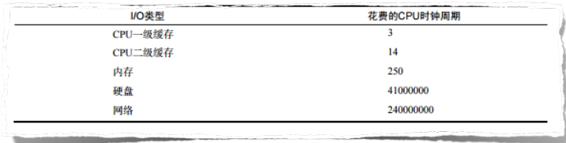
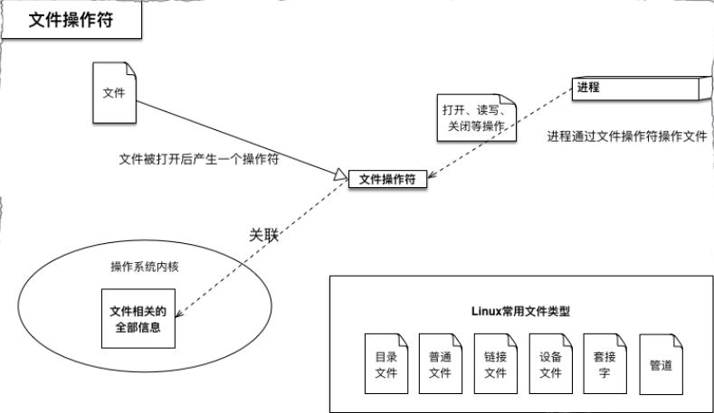

# 了解任务处理模型及异步IO

## 任务处理模型
1. 单线程阻塞 IO
2. 多线程非阻塞 IO 
3. 单线程非阻塞 IO 

#### 知识预备
```
每秒查询率 QPS = 并发量 / 平均响应时间 
```
QPS越高，服务器的并发能力越强

### 单线程阻塞
一个一个处理，必须等待I/O读取完成，再进行下一个任务。

### 多线程非阻塞
通过使用线程切换，避免了CPU因等待IO操作的闲置，最大程度上利用了CPU资源。
但是线程间频繁的上下文切换(Context switch)增加了额外的开销，导致性能严重下降，实际QPS并没达到理想值。其本质是数据的交换，它是很昂贵的，要尽可能避免。

### 单线程非阻塞
1. 收到请求， 注册本次IO读取的回调函数来处理数据并响应
2. 继续下一个请求，注册本次IO读取的回调函数
3. 请求处理结束，依次执行IO读取注册的回调函数
使用异步IO，线程不阻塞，也没有上下文切换带来的开销。


## 异步IO

异步IO模型需要一个事件循环，主线程不断地重复“事件循环”这一过程。
当遇到IO操作时，只发出IO请求，不等待IO的结果，然后继续本轮(或下一轮)事件循环。当IO操作完成后，将收到一条“IO完成”的消息，处理该消息以获取IO操作的结果。
对于大多数IO密集型的应用程序，使用异步IO将大大提升系统的多任务处理能力。

#### 知识预备 反衬一下异步IO的优势

**时钟周期**
在计算机中，以CPU运算速度为基准，计时钟周期为1，其次分别是一级缓存、二级缓存、内存、硬盘和网络。显而易见，CPU的速度远远快于磁盘、网络等IO。
I/O类型及其花费的CPU时钟周期:


```
CPU时钟周期 = 1s/cpu主频
```
cpu在一个时钟周期仅完成一个最基本的动作;
完成一个基本操作的时间为机器周期，一般由几个时钟周期组成;
完成一条指令为指令周期，一般由几个机器周期组成，指令不同机器周期数也不同。


**Amdahl定律**
Ws：串行分量
Wp：并行分量
p: 处理器数目
加速比 S = (Ws+Wp)/(Ws+Wp/p)
串行分量比例 f = Ws/(Ws+Wp)
S = p/(1+f(p-1))
p趋向于无穷时， S = 1/f。随着处理器数目的不断增加，整个系统所能达到的最大加速比是有上限的。

**文件描述(操作)符**
操作系统对计算机进行了抽象，将所有输入输出设备抽象为文件。内核在进行文件I/O操作时，通过文件描述符进行管理。应用程序如果需要进行IO需要打开文件描述符，在进行文件和数据的读写。异步IO不带数据直接返回，要获取数据还需要通过文件描述符再次读取。
意思就是操作文件拿的是文件操作符。



## Node对异步IO的实现

[传送门](./event_loop.md)
