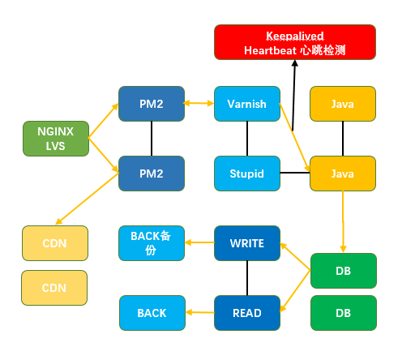

## 集群



### 多线程

* Master进程均为主进程，Fork可以创造主从进程。
* 通过child_process可以和NET模块组合，可以创建多个线程并监听统一端口。通过句柄传递完成自动重启、发射自杀信号、限量重启、负载均衡。
* Node默认的机制是采用操作系统的抢占式策略。闲着的进程争抢任务，但是会造成CPU闲置的IO暂时并未闲置。Node后来引入了Round-Robin机制，也叫轮叫调度。主进程接受任务，在分配。
* 每个子进程做好自己的事，然后通过进程间通信来将他们连接起来。这符合Unix的设计理念，每个进程只做一件事，并做好。将复杂分解为简单，将简单组合成强大。

### cluster
```js
var cluster = require('cluster');
var http = require('http');
var numCPUs = require('os').cpus().length;
if (cluster.isMaster) {
  require('os').cpus().forEach(function(){
    cluster.fork();
  });
  cluster.on('exit', function(worker, code, signal) {
    console.log('worker ' + worker.process.pid + ' died');
  });
  cluster.on('listening', function(worker, address) {
    console.log("A worker with #"+worker.id+" is now connected to " + address.address + ":" + address.port);
  });
} else {
http.createServer(function(req, res) {
    res.writeHead(200);
    res.end("hello world\n");
    console.log('Worker #' + cluster.worker.id + ' make a response');
  }).listen(8000);
}
```

### PM2[传送门](./deploy.md)

### pm2的优势 
pm2 是一个带有负载均衡功能的Node应用的进程管理器.
1. 内建负载均衡（使用Node cluster 集群模块）
2. 后台运行
3. 0秒停机重载
4. 具有Ubuntu和CentOS 的启动脚本
5. 停止不稳定的进程（避免无限循环）
6. 控制台检测
7. 提供 HTTP API
8. 远程控制和实时的接口API ( Nodejs 模块,允许和PM2进程管理器交互 )

### pm2基础命令

```bash
    #启动
    pm2 start pm2.json
    #关闭
    pm2 stop all
    #重启
    pm2 reload all
    #服务列表
    pm2 list
    #日志
    pm2 logs
    #监控
    pm2 monit
```

